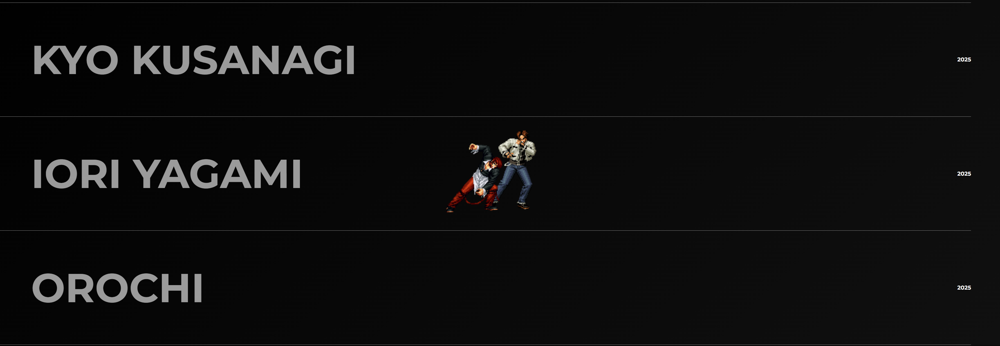

# Neo Fighters 🎮

A modern, animated web experience inspired by **The King of Fighters** franchise.  
Built with **HTML, CSS, JavaScript, GSAP, and Locomotive Scroll**, this project combines smooth animations, responsive design, and interactive elements to showcase creativity and technical skills.

---

## 🚀 Features

- 🎥 **Dynamic Hero Section** with smooth GSAP animations
- 🖱️ **Interactive Mouse Follower** with character GIFs (tilt + idle states)
- 📜 **Smooth Scrolling Experience** powered by Locomotive Scroll
- 🖼️ **Hover Animations** on character cards with responsive effects
- 📺 **Embedded Gameplay Video** with toggle (open/close)
- 📱 **Responsive Design** optimized for desktop, tablet, and mobile
- ⏱️ **Live Clock** in footer showing real-time updates

---

## 🛠️ Tech Stack

- **Frontend:** HTML5, CSS3, JavaScript (ES6)
- **Animation:** GSAP (GreenSock Animation Platform)
- **Scrolling:** Locomotive Scroll
- **Icons:** Remix Icon
- **Fonts:** Google Fonts (Bangers, Montserrat, Roboto)

---
## 🔗 Live Demo

(https://aryanbhardwaj4224.github.io/Modern-Web/)
View Project Here

---
## 📸 Screenshots

### Hero Section


### Character Showcase


---

## 🎮 Inspiration

This project is heavily inspired by **The King of Fighters** series, paying tribute to its iconic characters and legendary arcade style. Special mention to **Takashi Nishiyama**, the visionary game designer behind Street Fighter and KOF.

---

## 📂 Project Structure
```
├── index.html # Main HTML file
├── style.css # Styling and responsiveness
├── loco.css # Locomotive scroll styles
├── script.js # Animations and interactivity
├── /gif # Character GIFs
├── /image # Backgrounds and assets
```

---

## ⚡ How to Run Locally

1. Clone this repository:
```bash
git clone https://github.com/Aryanbhardwaj4224/Modern-Web.git
```
2.Open the folder:
```bash
cd Modern-Web
```
3.Run the project by simply opening index.html in your browser.

---

## 👤 Author
** Aryan Bhardwaj **


